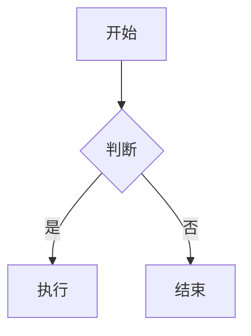

# mdvn 全语法演示文档

> 本文档覆盖 mdvn 支持范围内的全部 GFM 语法,以及按项目裁决"故意退化/不支持"的语法(见各节标注)。用来人工核对渲染效果是否符合预期,也可以作为回归语料长期维护——新增语法支持时应该回到这份文档补充对应小节。
>
> front matter(本文件开头的 `---` 包裹区块)应当被解析为元数据并**隐藏不显示**,你如果在窗口里看到这段引用块作为第一屏内容,说明 front matter 隐藏正常。

## 1. 标题层级

# 一级标题 H1
## 二级标题 H2
### 三级标题 H3
#### 四级标题 H4
##### 五级标题 H5
###### 六级标题 H6

## 2. 段落与行内样式

这是一个普通段落,包含 **粗体文字**、*斜体文字*、***粗斜体文字***、~~删除线文字~~、`行内代码` 以及混合样式 **粗体里套*斜体***。

这一行末尾有两个空格强制换行,  
下一行应该独立成行,而不是和上一行合并成一段。

这是被硬换行分隔的第二次演示。\
上面这行用的是反斜杠换行(GFM 硬换行的另一种写法)。

## 3. 引用块

> 这是一段引用文字。
>
> 引用块可以有多个段落。
>
> > 这是嵌套引用(引用中的引用),应该有两层竖线。
> >
> > > 三层嵌套引用。

## 4. 列表

### 4.1 无序列表(含三层嵌套)

- 第一层项目 A
    - 第二层项目 A-1
        - 第三层项目 A-1-i
        - 第三层项目 A-1-ii
    - 第二层项目 A-2
- 第一层项目 B
- 第一层项目 C

### 4.2 有序列表(含非 1 起始序号与嵌套)

5. 第五项(起始序号 5,后续应自动递增为 6/7)
6. 第六项
   1. 嵌套有序子项一
   2. 嵌套有序子项二
7. 第七项

### 4.3 有序列表嵌套无序列表 / 无序列表嵌套有序列表

1. 有序项一
   - 嵌套无序子项 A
   - 嵌套无序子项 B
2. 有序项二

- 无序项一
  1. 嵌套有序子项 1
  2. 嵌套有序子项 2
- 无序项二

### 4.4 任务列表

- [x] 已完成的任务
- [ ] 未完成的任务
- [x] 另一个已完成任务,这条内容故意写得比较长,用来观察换行是否正常显示、会不会和后面的任务项重叠或者错位对齐
- [ ] 嵌套任务列表:
  - [x] 子任务已完成
  - [ ] 子任务未完成

### 4.5 紧凑列表 vs 松散列表

紧凑列表(项之间无空行):

- 紧凑项一
- 紧凑项二
- 紧凑项三

松散列表(项之间有空行,每项应该被包成独立段落):

- 松散项一

- 松散项二

- 松散项三

## 5. 代码块

### 5.1 缩进式代码块

    def indented_example():
        return "四个空格缩进的代码块"

### 5.2 围栏代码块(带语言标注)

```rust
fn main() {
    let x = 1;
    let y = 2;
    println!("sum = {}", x + y);
}
```

```python
def fibonacci(n):
    a, b = 0, 1
    for _ in range(n):
        a, b = b, a + b
    return a
```

### 5.3 围栏代码块(无语言标注)

```
plain text code block
no syntax highlighting expected
line two
line three
```

## 6. 表格

### 6.1 基础对齐测试

| 左对齐 | 居中对齐 | 右对齐 |
|:---|:---:|---:|
| a | b | c |
| 短 | 中等长度内容 | 1 |
| 长一点的内容测试 | 短 | 22 |

### 6.2 中英混排宽表格

| 名称 | 说明 | 数值 |
|---|---|---:|
| Alpha | 左对齐说明文字 | 1 |
| Beta | 居中/常规说明 | 22 |
| Gamma | 英文单词换行测试 | 333 |
| 网关服务 | 中文说明与 English word 混排 | 4444 |

### 6.3 超宽表格(七列)

| 列一 | 列二 | 列三 | 列四 | 列五 | 列六 | 列七 |
|---|---|---|---|---|---|---|
| 这是一段比较长的中文内容测试超宽 | short | data | 1234567890 | more content here | x | y |
| a | b | c | d | e | f | g |

## 7. 链接与图片

### 7.1 行内链接

[带标题的链接](https://example.com "这是链接标题") 、[不带标题的链接](https://example.com)。

### 7.2 引用式链接

这是一个[引用式链接][ref1],定义在文档末尾。

### 7.3 自动链接(裸 URL)

直接粘贴的裸网址应该自动识别成链接:https://example.com/path?query=1 以及 www.example.com(GFM 宽松自动链接)。

### 7.4 本地图片


### 7.5 data: URI 图片(1x1 红色像素,base64 内嵌)


### 7.6 SVG 图片(项目裁决:不做矢量渲染,应显示占位框)


### 7.7 多帧 GIF(项目裁决:WIC 只解第一帧,不做动画播放)


### 7.8 网络图片(项目裁决:默认不加载,应显示"点击加载"占位)


### 7.9 超大图片(应触发降采样 + "已压缩·点击看原图"角标)


## 8. 脚注

这里是正文中的第一处脚注引用[^note1],这里是第二处脚注引用[^note2],这里重复引用第一个脚注[^note1]。

[^note1]: 这是第一个脚注的定义内容。
[^note2]: 这是第二个脚注的定义内容,可以写得长一些用来测试脚注区域的换行是否正常。

## 9. 水平分割线

上面一段。

---

下面一段(分割线上下应该各有段落,分割线本身应该是一条细横线,不应该有多余间距或者跟内容重叠)。

## 10. 项目裁决"不支持,应原样退化"的语法(以下均为预期行为,不是 bug)

### 10.1 LaTeX 数学公式(裁决:不解析,原样等宽文本显示)

行内公式 $E = mc^2$ 应该原样显示成等宽文本,不应该被排版成真正的数学公式。

块级公式:

$$
\int_0^\infty e^{-x} dx = 1
$$

上面这段也应该原样显示为文本,不解析。

### 10.2 Mermaid 图表(裁决:退化为普通代码块,不渲染图形)



上面应该显示成普通的等宽代码块文本,不应该渲染成流程图。

### 10.3 HTML 内联/块(裁决:按纯文本原样显示,不解释执行)

这段文字里有一个 <strong>HTML 加粗标签</strong> 和一个 <em>HTML 斜体标签</em>,标签本身应该原样显示为文本字符,不应该被当成真正的加粗/斜体。

<div class="test-block">
这是一个 HTML 块级标签包裹的内容,应该整体按纯文本显示,标签字符原样可见。
</div>

### 10.4 Emoji 短码(裁决:不做短码转换,应保留原始文本)

这是一个短码 :smile: 和另一个短码 :+1:,项目不维护短码映射表,应该原样显示冒号包裹的文本,不转换成 emoji 图形。

## 11. 综合压力段落

这是一段很长很长的中英文混排文字,用来测试自动换行是否正常工作:这是中文部分这是中文部分这是中文部分 this is an English sentence mixed in the middle 这是中文部分这是中文部分 followed by another English clause that is reasonably long to force a wrap somewhere in the middle of this paragraph 最后是一段结尾的中文文字用来收尾。

[ref1]: https://example.com/referenced-link "引用式链接的标题"
